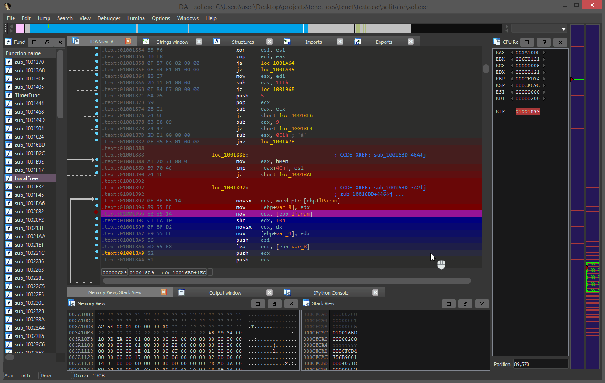
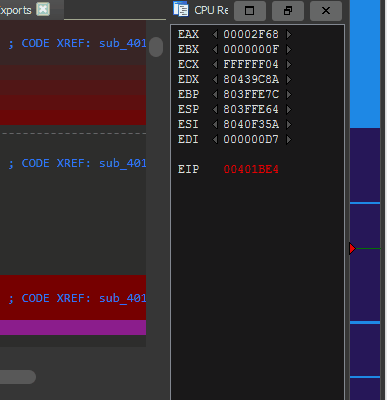
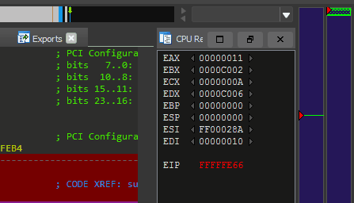
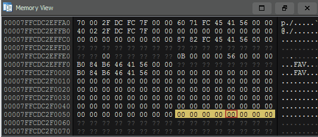
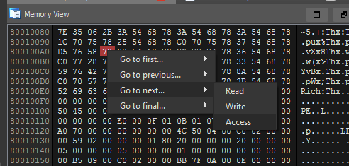

# Tenet - A Trace Explorer for Reverse Engineers

## Overview

Tenet is an [IDA Pro](https://www.hex-rays.com/products/ida/) plugin for exploring execution traces. The goal of this plugin is to provide more natural, human controls for navigating execution traces against a given binary. The basis of this work stems from the desire to research new or innovative methods to examine and distill complex execution patterns in software.

For more context about this project, please read the [blogpost](http://blog.ret2.io/2021/04/20/tenet-trace-explorer/) about its initial release.

Special thanks to [QIRA](https://github.com/geohot/qira) / [geohot](https://twitter.com/realGeorgeHotz) et al. for the inspiration.

## Releases

* v0.2 -- Imagebase detection, cell visualization, breakpoint refactor, bugfixes.
* v0.1 -- Initial release

# Installation

Tenet is a cross-platform (Windows, macOS, Linux) Python 3 plugin. It takes zero third party dependencies, making the code both portable and easy to install.

1. From your disassembler's python console, run the following command to find its plugin directory:
   - **IDA Pro**: `import idaapi, os; os.path.join(idaapi.get_user_idadir(), "plugins")`

2. Copy the contents of this repository's `/plugins/` folder to the listed directory.
3. Restart your disassembler.

This plugin is only supported for IDA 7.5 and newer.

# Usage

Once properly installed, there will be a new menu entry available in the disassembler. This can be used to load externally-collected execution traces into Tenet.

As this is the initial release, Tenet only accepts simple human-readable text traces. Please refer to the [tracing readme](https://github.com/gaasedelen/tenet/tree/master/tracers) in this repository for additional information on the trace format, limitations, and reference tracers.

## Bidirectional Exploration

While using Tenet, the plugin will 'paint' trails to indicate the flow of execution forwards (blue) and backwards (red) from your present position in the active execution trace. 

To `step` forwards or backwards through time, you simply *scroll while hovering over the timeline* on the right side of the disassembler. To `step over` function calls, hold `SHIFT` while scrolling. 

## Trace Timeline

The trace timeline will be docked on the right side of the disassembler. This widget is used to visualize different types of events along the trace timeline and perform basic navigation as described above.

By *clicking and dragging across the timeline*, it is possible to zoom in on a specific section of the execution trace. This action can be repeated any number of times to reach the desired granularity. 

## Execution Breakpoints

Double clicking the instruction pointer in the registers window will highlight it in red, revealing all the locations the instruction was executed across the trace timeline.

To jump between executions, *scroll up or down while hovering the highlighted instruction pointer*.

Additionally, you can *right click in the disassembly listing* and select one of the navigation-based menu entries to quickly seek to the execution of an instruction of interest. 

IDA's native `F2` hotkey can also be used to set breakpoints on arbitrary instructions. 

## Memory Breakpoints

By double clicking a byte in either the stack or memory views, you will instantly see all reads/writes to that address visualized across the trace timeline. Yellow indicates a memory *read*, blue indicates a memory *write*.

Memory breakpoints can be navigated using the same technique described for execution breakpoints. Double click a byte, and *scroll while hovering the selected **byte*** to seek the trace to each of its accesses.

*Right clicking a byte* of interest will give you options to seek between memory read / write / access if there is a specific navigation action that you have in mind.

To navigate the memory view to an arbitrary address, click onto the memory view and hit `G` to enter either an address or database symbol to seek the view to. 

## Region Breakpoints

It is possible to set a memory breakpoint across a region of memory by highlighting a block of memory, and double clicking it to set an access breakpoint.

As with normal memory breakpoints, hovering the region and *scrolling* can used to traverse between the accesses made to the selected region of memory. 

## Register Seeking

In reverse engineering, it's pretty common to encounter situations where you ask yourself *"Which instruction set this register to its current value?"* 

Using Tenet, you can seek backwards to that instruction in a single click. 

Seeking backwards is by far the most common direction to navigate across register changes... but for dexterity you can also seek forward to the next register assignment using the blue arrow on the right of the register.

## Timestamp Shell

A simple 'shell' is provided to navigate to specific timestamps in the trace. Pasting (or typing...) a timestamp into the shell with or without commas will suffice. 

Using an exclamation point, you can also seek a specified 'percentage' into the trace. Entering `!100` will seek to the final instruction in the trace, where `!50` will seek approximately 50% of the way through the trace. `!last` will seek to the last navigable instruction that can be viewed in the disassembler.

## Themes

Tenet ships with two default themes -- a 'light' theme, and a 'dark' one. Depending on the colors currently used by your disassembler, Tenet will attempt to select the theme that seems most appropriate.

The theme files are stored as simple JSON on disk and are highly configurable. If you are not happy with the default themes or colors, you can create your own themes and simply drop them in the user theme directory.

Tenet will remember your theme preference for future loads and uses.

# FAQ

#### Q: How do I record an execution trace using Tenet?

* *A: Tenet is a trace reader, not a trace recorder. You will have to use dynamic binary instrumentation frameworks (or other related technologies) to generate a compatible execution trace. Please refer to the [tracing](https://github.com/gaasedelen/tenet/tree/master/tracers) readme for more information on existing tracers, or how to implement your own.*

#### Q: What trace architectures does Tenet support loading?

* *A: Only x86 and AMD64, but the codebase is almost entirely architecture agnostic.*

#### Q: How big of a trace file can Tenet load / navigate?

* *A: Tenet's trace reader is pure python, it was written as an MVP. There is no guarantee that traces which exceed 10 million instructions will be reasonable to navigate until a native backend replaces it.*

#### Q: I loaded an execution trace, now there is a '.tt' file. What is it?

* *A: When Tenet loads a given text trace, it will parse, index, and compress the trace into a more performant format. On subsequent loads, Tenet will attempt to load the '.tt' file which should load in fraction of the time that it would take to load the original text trace.*

#### Q: The plugin crashed / threw an error / is showing bad trace information, what should I do?

* *A: If you encounter an issue or inaccuracy that can be reproduced, please file an issue against this repository and upload a sample trace + executable.*

#### Q: Memory in my trace is changing, but there are no writes to the region. Is this a bug!?

* *A: Your log file may not have captured all memory writes. For example, usermode DBI generally do not get a memory callback for external writes to process memory. This is most common when reading from a file, or from socket -- it is the kernel that writes memory into your designated usermode buffer, making the event invisible to traditional instrumentation.*
	* Microsoft TTD generally exhibits the same behavior, it's tricky to solve without modeling syscalls. 

#### Q: Will this be ported to Binary Ninja / Ghidra / ... ? 

* *A: Possibly, but not anytime soon (unless there is __significant__ incentive). As a research oriented project, the driving motivation is on developing novel strategies to organize and explore program execution -- not porting them.*

#### Q: My organization would like to support this project, how can we help?

* *A: Without funding, the time I can devote to this project is limited. If your organization is excited by the ideas put forth here and capable of providing capital to sponsor dedicated R&D, please [contact us](https://ret2.io/contact).*

# Future Work

Time and ~~motivation~~ funding permitting, future work may include:

* Filtering / coagulating library calls from traces
* Pointer analysis (e.g. annotations) for the register / stack views
* Native TraceFile & TraceReader implementations (e.g. bigger and faster traces)
* Navigation history + bookmarks view (maybe 2-in-1?)
* Richer trace informatics, more aggressive indexing of relevant events (e.g. function calls)
* Trace cartography, improved summarization and representation of trace geography
* Make the 'cpu architecture' selection/detection slightly less hardcoded
* More out-of-the-box tracing bridges, DynamoRIO, TTD, RR, QEMU, Bochs, ...
* Support for Hex-Rays / decompiled views (besides basic view sync) 
* Improved workflow for automatically loading or iterating on traces
* Differential analysis, high level 'trace diffing'
* Better navigation and breakdown of threads, quantum's
* Better support for navigating 'multi module' traces (e.g. full system traces)
* Binary Ninja support
* ... ?

I welcome external contributions, issues, and feature requests. Please make any pull requests to the `develop` branch of this repository if you would like them to be considered for a future release.

# Authors

* Markus Gaasedelen ([@gaasedelen](https://twitter.com/gaasedelen))
